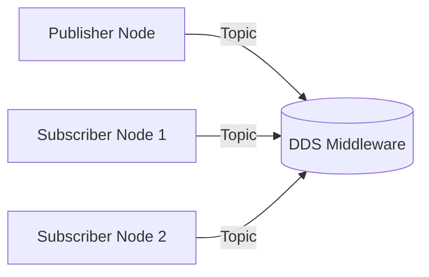
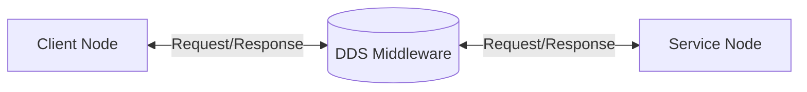
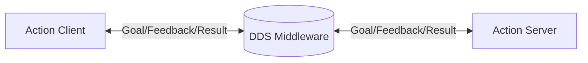

# ROS 2 Architecture and Core Concepts

## Introduction to ROS 2

Robot Operating System 2 (ROS 2) is the next-generation middleware framework for robot development. Unlike its predecessor, ROS 2 addresses the challenges of real-world robot deployment with improved security, real-time capabilities, and robust communication mechanisms.

## Architectural Overview

ROS 2 follows a distributed computing architecture based on the Data Distribution Service (DDS) standard. This architecture enables:

- **Decentralized Communication**: No single point of failure
- **Language Independence**: Support for multiple programming languages
- **Platform Portability**: Cross-platform compatibility
- **Real-time Support**: Deterministic timing guarantees for critical systems

## Core Architecture Components

### Nodes
Nodes are the fundamental execution units in ROS 2. Each node represents a single process that performs specific robot functionality.

**Key characteristics:**
- Encapsulate specific robot capabilities
- Communicate with other nodes through topics, services, and actions
- Can be written in different programming languages
- Support lifecycle management for complex systems

### Topics and Publishers/Subscribers
Topics enable asynchronous, many-to-many communication between nodes using a publish-subscribe pattern.

**Key features:**
- Data is published to named topics
- Multiple subscribers can receive the same data
- Real-time performance with configurable QoS settings
- Support for message serialization and transport

### Services and Clients
Services provide synchronous, request-response communication between nodes.

**Use cases:**
- Configuration requests
- One-time data queries
- Command execution with confirmation
- Synchronous coordination

### Actions
Actions enable asynchronous, goal-oriented communication with feedback and status updates.

**Components:**
- Goal: Requested action with parameters
- Feedback: Continuous updates during execution
- Result: Final outcome of the action
- Cancel: Mechanism to interrupt long-running actions

## Quality of Service (QoS) Profiles

QoS profiles allow fine-tuning of communication behavior:

- **Reliability**: Best effort vs. reliable delivery
- **Durability**: Volatile vs. transient local data persistence
- **History**: Keep last N samples vs. keep all samples
- **Deadline**: Maximum time between consecutive samples
- **Liveliness**: How to detect if a participant is alive

## ROS 2 Communication Patterns

### Publish-Subscribe Pattern

The publish-subscribe pattern enables decoupled, asynchronous communication where publishers send messages to topics without knowledge of subscribers.

### Client-Service Pattern

The client-service pattern provides synchronous communication with guaranteed delivery and response.

### Action Pattern

The action pattern supports long-running tasks with continuous feedback and cancellation capability.

## Security Architecture

ROS 2 includes built-in security features:

- **Authentication**: Identity verification for nodes and clients
- **Access Control**: Authorization policies for topics and services
- **Encryption**: Data encryption in transit and at rest
- **Signing**: Message authentication and integrity protection

## Lifecycle Management

ROS 2 provides lifecycle management for complex robot systems:

- **Unconfigured**: Node loaded but not configured
- **Inactive**: Configured but not active
- **Active**: Fully operational
- **Finalized**: Ready for cleanup

## Integration with Physical AI Systems

ROS 2 is particularly well-suited for Physical AI systems because:

- **Real-time Capabilities**: Supports deterministic timing for safety-critical systems
- **Distributed Architecture**: Enables complex multi-robot systems
- **Language Support**: Allows integration of specialized libraries in different languages
- **Simulation Integration**: Seamless transition between simulation and real hardware

## Learning Objectives

After completing this chapter, you should be able to:
- Explain the core architectural components of ROS 2
- Distinguish between topics, services, and actions
- Configure Quality of Service profiles for different use cases
- Understand the security architecture of ROS 2
- Apply lifecycle management to complex robot systems

## Key Takeaways

- ROS 2 provides a robust middleware for robot communication
- The architecture supports distributed, real-time systems
- Multiple communication patterns serve different robot needs
- Security and lifecycle management are built into the architecture
- ROS 2 is designed for both simulation and real-world deployment