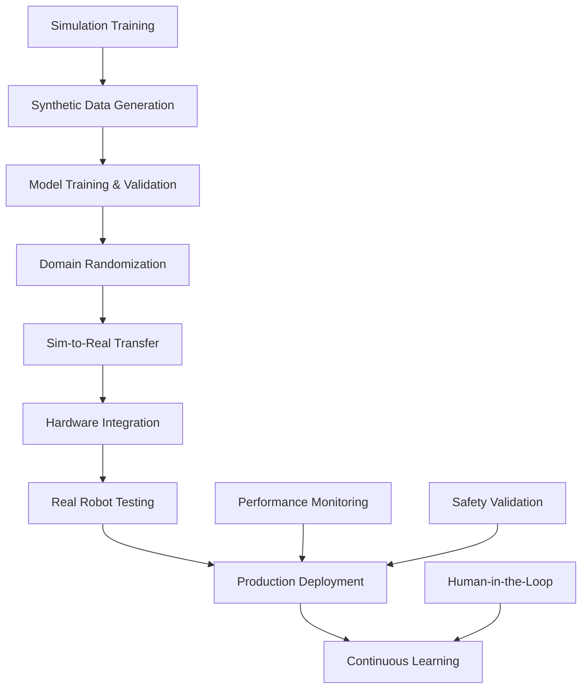

# VLA Deployment Guide

## From Simulation to Real Hardware

This module covers the complete deployment pipeline for Vision-Language-Action (VLA) systems, from simulation training to real-world hardware deployment. It addresses the critical challenges of sim-to-real transfer, hardware integration, and production deployment.

### VLA Deployment Architecture

#### Production Deployment Pipeline



### Hardware Requirements for VLA Systems

#### Compute Requirements

**Minimum Specifications:**
- **GPU**: NVIDIA RTX 3070 or equivalent (8GB+ VRAM)
- **CPU**: 8+ core processor (Intel i7 or AMD Ryzen 7)
- **RAM**: 16GB system memory
- **Storage**: 1TB SSD for model storage and data
- **Networking**: Gigabit Ethernet for sensor integration

**Recommended Specifications:**
- **GPU**: NVIDIA RTX 4080/4090 or A6000 (16GB+ VRAM)
- **CPU**: 12+ core processor (Intel i9 or AMD Ryzen 9)
- **RAM**: 32GB+ system memory
- **Storage**: 2TB+ NVMe SSD
- **Networking**: 10GbE for high-bandwidth sensor data

#### Robot Hardware Integration

```yaml
# hardware-config.yaml
robot:
  platform: "humanoid"
  manufacturer: "custom"
  model: "physical-ai-humanoid-v1"

sensors:
  cameras:
    - name: "front_camera"
      type: "rgb_depth"
      resolution: [640, 480]
      frequency: 30
      fov: 60
    - name: "realsense_d435"
      type: "stereo_depth"
      resolution: [1280, 720]
      frequency: 30

  lidar:
    - name: "front_lidar"
      type: "2d_lidar"
      range: [0.1, 25.0]
      frequency: 10
      resolution: 0.25

  imu:
    - name: "imu_sensor"
      type: "9dof"
      frequency: 100
      accuracy:
        accelerometer: "±0.05g"
        gyroscope: "±0.005 dps"
        magnetometer: "±0.1°"

  force_torque:
    - name: "wrist_force_sensor"
      type: "6axis_force_torque"
      frequency: 100
      range: [±100N, ±10Nm]

actuators:
  joints:
    - name: "hip_pitch_left"
      type: "servo"
      limits: [-1.57, 1.57]
      velocity: 2.0
      effort: 100.0
    - name: "knee_pitch_left"
      type: "servo"
      limits: [0.0, 2.0]
      velocity: 2.0
      effort: 100.0
    # ... additional joints

communication:
  protocols:
    - "ros2_humble"
    - "ethernet"
    - "wifi_6"
  bandwidth:
    sensors: "100 Mbps"
    control: "10 Mbps"
    video: "50 Mbps"

power:
  requirements:
    continuous: "500W"
    peak: "1000W"
  battery:
    voltage: "24V"
    capacity: "50Ah"
    runtime: "2 hours"
```

### Real Hardware Integration

#### Sensor Integration Framework

```python
import rclpy
from rclpy.node import Node
from sensor_msgs.msg import Image, PointCloud2, Imu, JointState
from std_msgs.msg import String
from geometry_msgs.msg import Twist
import cv2
import numpy as np
import threading
import queue
from typing import Dict, Any, Callable, Optional

class HardwareIntegrationNode(Node):
    def __init__(self):
        super().__init__('hardware_integration_node')

        # Initialize sensor data queues
        self.sensor_queues = {
            'camera': queue.Queue(maxsize=10),
            'lidar': queue.Queue(maxsize=10),
            'imu': queue.Queue(maxsize=10),
            'joint_states': queue.Queue(maxsize=10)
        }

        # Initialize publishers and subscribers
        self.setup_hardware_communication()

        # Initialize VLA model interface
        self.vla_model_interface = VLAHardwareInterface()

        # Initialize hardware monitoring
        self.hardware_monitor = HardwareMonitor(self)

        # Initialize calibration manager
        self.calibration_manager = CalibrationManager()

        # Start processing threads
        self.processing_threads = []
        for sensor_type in self.sensor_queues.keys():
            thread = threading.Thread(
                target=self.process_sensor_data,
                args=(sensor_type,)
            )
            thread.daemon = True
            thread.start()
            self.processing_threads.append(thread)

        self.get_logger().info('Hardware integration node initialized')

    def setup_hardware_communication(self):
        """Setup communication with hardware sensors and actuators"""
        # Camera subscribers
        self.camera_sub = self.create_subscription(
            Image,
            '/camera/color/image_raw',
            self.camera_callback,
            10
        )
        self.depth_sub = self.create_subscription(
            Image,
            '/camera/depth/image_rect_raw',
            self.depth_callback,
            10
        )

        # LiDAR subscriber
        self.lidar_sub = self.create_subscription(
            PointCloud2,
            '/scan',
            self.lidar_callback,
            10
        )

        # IMU subscriber
        self.imu_sub = self.create_subscription(
            Imu,
            '/imu/data',
            self.imu_callback,
            10
        )

        # Joint state subscriber
        self.joint_sub = self.create_subscription(
            JointState,
            '/joint_states',
            self.joint_state_callback,
            10
        )

        # Robot command publisher
        self.cmd_pub = self.create_publisher(
            Twist,
            '/cmd_vel',
            10
        )

        # VLA result publisher
        self.vla_result_pub = self.create_publisher(
            String,
            '/vla/hardware_result',
            10
        )

    def camera_callback(self, msg):
        """Process camera data from real hardware"""
        try:
            # Convert ROS image to OpenCV format
            cv_image = self.bridge.imgmsg_to_cv2(msg, "bgr8")

            # Apply calibration
            calibrated_image = self.calibration_manager.undistort_image(cv_image)

            # Add to processing queue
            sensor_data = {
                'image': calibrated_image,
                'timestamp': msg.header.stamp.sec + msg.header.stamp.nanosec * 1e-9,
                'encoding': msg.encoding,
                'header': msg.header
            }

            try:
                self.sensor_queues['camera'].put_nowait(sensor_data)
            except queue.Full:
                self.get_logger().warn('Camera queue full, dropping frame')

        except Exception as e:
            self.get_logger().error(f'Camera processing error: {e}')

    def lidar_callback(self, msg):
        """Process LiDAR data from real hardware"""
        try:
            # Convert PointCloud2 to numpy array
            points = self.pointcloud2_to_array(msg)

            sensor_data = {
                'points': points,
                'timestamp': msg.header.stamp.sec + msg.header.stamp.nanosec * 1e-9,
                'header': msg.header
            }

            try:
                self.sensor_queues['lidar'].put_nowait(sensor_data)
            except queue.Full:
                self.get_logger().warn('LiDAR queue full, dropping data')

        except Exception as e:
            self.get_logger().error(f'LiDAR processing error: {e}')

    def imu_callback(self, msg):
        """Process IMU data from real hardware"""
        try:
            sensor_data = {
                'linear_acceleration': [
                    msg.linear_acceleration.x,
                    msg.linear_acceleration.y,
                    msg.linear_acceleration.z
                ],
                'angular_velocity': [
                    msg.angular_velocity.x,
                    msg.angular_velocity.y,
                    msg.angular_velocity.z
                ],
                'orientation': [
                    msg.orientation.x,
                    msg.orientation.y,
                    msg.orientation.z,
                    msg.orientation.w
                ],
                'timestamp': msg.header.stamp.sec + msg.header.stamp.nanosec * 1e-9,
                'header': msg.header
            }

            try:
                self.sensor_queues['imu'].put_nowait(sensor_data)
            except queue.Full:
                self.get_logger().warn('IMU queue full, dropping data')

        except Exception as e:
            self.get_logger().error(f'IMU processing error: {e}')

    def joint_state_callback(self, msg):
        """Process joint state data from real hardware"""
        try:
            sensor_data = {
                'joint_names': msg.name,
                'positions': msg.position,
                'velocities': msg.velocity,
                'efforts': msg.effort,
                'timestamp': msg.header.stamp.sec + msg.header.stamp.nanosec * 1e-9,
                'header': msg.header
            }

            try:
                self.sensor_queues['joint_states'].put_nowait(sensor_data)
            except queue.Full:
                self.get_logger().warn('Joint state queue full, dropping data')

        except Exception as e:
            self.get_logger().error(f'Joint state processing error: {e}')

    def process_sensor_data(self, sensor_type):
        """Process sensor data in background thread"""
        while rclpy.ok():
            try:
                sensor_data = self.sensor_queues[sensor_type].get(timeout=1.0)

                # Process sensor data through VLA pipeline
                processed_data = self.vla_model_interface.process_sensor_data(
                    sensor_type, sensor_data
                )

                # Update hardware state
                self.update_hardware_state(sensor_type, processed_data)

            except queue.Empty:
                continue
            except Exception as e:
                self.get_logger().error(f'Error processing {sensor_type} data: {e}')

    def update_hardware_state(self, sensor_type, processed_data):
        """Update hardware state based on processed data"""
        # Update internal state representation
        self.hardware_monitor.update_sensor_state(sensor_type, processed_data)

        # Check for hardware issues
        self.hardware_monitor.check_for_issues()

    def pointcloud2_to_array(self, msg):
        """Convert PointCloud2 message to numpy array"""
        import sensor_msgs.point_cloud2 as pc2
        points = pc2.read_points_numpy(
            msg,
            field_names=["x", "y", "z"],
            skip_nans=True
        )
        return points

    def execute_vla_command_on_hardware(self, vla_output):
        """Execute VLA model output on real hardware"""
        try:
            # Convert VLA output to hardware commands
            hardware_commands = self.convert_vla_to_hardware_commands(vla_output)

            # Execute commands on hardware
            success = self.send_commands_to_hardware(hardware_commands)

            # Publish result
            result_msg = String()
            result_msg.data = json.dumps({
                'success': success,
                'commands_executed': hardware_commands,
                'timestamp': time.time()
            })
            self.vla_result_pub.publish(result_msg)

            return success

        except Exception as e:
            self.get_logger().error(f'Error executing VLA command on hardware: {e}')
            return False

    def convert_vla_to_hardware_commands(self, vla_output):
        """Convert VLA model output to hardware commands"""
        commands = {}

        # Convert navigation commands
        if 'navigation_command' in vla_output:
            nav_cmd = vla_output['navigation_command']
            commands['navigation'] = {
                'linear_x': float(nav_cmd[0]),
                'linear_y': float(nav_cmd[1]),
                'angular_z': float(nav_cmd[2])
            }

        # Convert manipulation commands
        if 'manipulation_command' in vla_output:
            manip_cmd = vla_output['manipulation_command']
            commands['manipulation'] = {
                'position_delta': [float(x) for x in manip_cmd[:3]],
                'orientation_delta': [float(x) for x in manip_cmd[3:]]
            }

        # Convert gripper commands
        if 'gripper_command' in vla_output:
            gripper_cmd = vla_output['gripper_command']
            commands['gripper'] = {
                'position': float(gripper_cmd)
            }

        return commands

    def send_commands_to_hardware(self, commands):
        """Send commands to real hardware"""
        success = True

        # Send navigation commands
        if 'navigation' in commands:
            nav_cmd = commands['navigation']
            twist_msg = Twist()
            twist_msg.linear.x = nav_cmd['linear_x']
            twist_msg.linear.y = nav_cmd['linear_y']
            twist_msg.angular.z = nav_cmd['angular_z']
            self.cmd_pub.publish(twist_msg)

        # Send manipulation commands (would interface with arm controller)
        if 'manipulation' in commands:
            # This would interface with real manipulator
            # For now, just log
            self.get_logger().info(f'Sending manipulation command: {commands["manipulation"]}')

        # Send gripper commands
        if 'gripper' in commands:
            # This would interface with real gripper
            # For now, just log
            self.get_logger().info(f'Sending gripper command: {commands["gripper"]}')

        return success


class HardwareMonitor:
    """Monitor hardware status and performance"""

    def __init__(self, node):
        self.node = node
        self.sensor_states = {}
        self.hardware_issues = []
        self.performance_metrics = {
            'sensor_latency': {},
            'processing_time': {},
            'bandwidth_usage': {}
        }

    def update_sensor_state(self, sensor_type, data):
        """Update sensor state"""
        self.sensor_states[sensor_type] = {
            'data': data,
            'timestamp': time.time(),
            'status': 'active'
        }

        # Calculate latency
        if 'timestamp' in data:
            latency = time.time() - data['timestamp']
            self.performance_metrics['sensor_latency'][sensor_type] = latency

    def check_for_issues(self):
        """Check for hardware issues"""
        issues = []

        # Check sensor latencies
        for sensor_type, latency in self.performance_metrics['sensor_latency'].items():
            if latency > 0.1:  # More than 100ms latency
                issues.append(f'High latency for {sensor_type}: {latency:.3f}s')

        # Check for missing sensor data
        for sensor_type in ['camera', 'lidar', 'imu', 'joint_states']:
            if sensor_type not in self.sensor_states:
                issues.append(f'Missing data for {sensor_type}')
            elif time.time() - self.sensor_states[sensor_type]['timestamp'] > 1.0:
                issues.append(f'No recent data for {sensor_type}')

        self.hardware_issues = issues

        # Log issues
        for issue in issues:
            self.node.get_logger().warn(f'Hardware issue detected: {issue}')

    def get_hardware_status(self):
        """Get current hardware status"""
        return {
            'sensor_states': self.sensor_states,
            'issues': self.hardware_issues,
            'performance_metrics': self.performance_metrics
        }


class CalibrationManager:
    """Manage hardware calibration"""

    def __init__(self):
        self.calibration_data = self.load_calibration_data()

    def load_calibration_data(self):
        """Load calibration data from file"""
        # In real implementation, load from calibration files
        # For simulation, return mock calibration
        return {
            'camera_matrix': np.eye(3, dtype=np.float32),
            'distortion_coeffs': np.zeros(5, dtype=np.float32),
            'extrinsic_transforms': {}
        }

    def undistort_image(self, image):
        """Undistort camera image using calibration"""
        if image is None:
            return None

        # Apply camera undistortion
        undistorted = cv2.undistort(
            image,
            self.calibration_data['camera_matrix'],
            self.calibration_data['distortion_coeffs']
        )

        return undistorted

    def calibrate_sensor_pair(self, sensor1_data, sensor2_data, sensor_pair_name):
        """Calibrate transformation between two sensors"""
        # In real implementation, perform sensor calibration
        # For simulation, return identity transform
        return np.eye(4, dtype=np.float32)

    def update_calibration(self, new_calibration_data):
        """Update calibration data"""
        self.calibration_data.update(new_calibration_data)
```

### Sim-to-Real Transfer Techniques

#### Domain Randomization for Real-World Deployment

```python
class DomainRandomizer:
    """Apply domain randomization for sim-to-real transfer"""

    def __init__(self, simulation_world):
        self.sim_world = simulation_world
        self.domain_config = self.load_domain_randomization_config()

    def load_domain_randomization_config(self):
        """Load domain randomization configuration"""
        return {
            'visual_randomization': {
                'lighting': {
                    'intensity_range': [300, 1200],
                    'color_temperature_range': [3000, 8000],
                    'direction_variance': 0.5
                },
                'textures': {
                    'roughness_range': [0.1, 0.9],
                    'metallic_range': [0.0, 0.5],
                    'normal_map_strength_range': [0.0, 1.0]
                },
                'colors': {
                    'hue_shift_range': [-0.1, 0.1],
                    'saturation_range': [0.5, 1.5],
                    'brightness_range': [0.8, 1.2]
                }
            },
            'physics_randomization': {
                'friction': {
                    'range': [0.1, 0.9]
                },
                'restitution': {
                    'range': [0.0, 0.3]
                },
                'mass': {
                    'variance': 0.1
                },
                'gravity': {
                    'variance': 0.1
                }
            },
            'sensor_randomization': {
                'noise': {
                    'gaussian_std': [0.001, 0.01],
                    'uniform_range': [0.001, 0.01]
                },
                'bias': {
                    'range': [-0.01, 0.01]
                },
                'drift': {
                    'rate_range': [1e-6, 1e-4]
                }
            }
        }

    def randomize_simulation_domain(self):
        """Apply domain randomization to simulation"""
        # Randomize visual properties
        self.randomize_visual_properties()

        # Randomize physics properties
        self.randomize_physics_properties()

        # Randomize sensor properties
        self.randomize_sensor_properties()

        # Randomize object properties
        self.randomize_object_properties()

    def randomize_visual_properties(self):
        """Randomize visual properties for domain randomization"""
        # Randomize lighting
        lights = self.sim_world.get_scene_lights()
        for light in lights:
            # Randomize intensity
            intensity = np.random.uniform(
                self.domain_config['visual_randomization']['lighting']['intensity_range'][0],
                self.domain_config['visual_randomization']['lighting']['intensity_range'][1]
            )
            light.set_intensity(intensity)

            # Randomize color temperature
            color_temp = np.random.uniform(
                self.domain_config['visual_randomization']['lighting']['color_temperature_range'][0],
                self.domain_config['visual_randomization']['lighting']['color_temperature_range'][1]
            )
            rgb_color = self.temperature_to_rgb(color_temp)
            light.set_color(rgb_color)

        # Randomize material properties
        materials = self.sim_world.get_scene_materials()
        for material in materials:
            # Randomize roughness
            roughness = np.random.uniform(
                self.domain_config['visual_randomization']['textures']['roughness_range'][0],
                self.domain_config['visual_randomization']['textures']['roughness_range'][1]
            )
            material.set_roughness(roughness)

            # Randomize metallic
            metallic = np.random.uniform(
                self.domain_config['visual_randomization']['textures']['metallic_range'][0],
                self.domain_config['visual_randomization']['textures']['metallic_range'][1]
            )
            material.set_metallic(metallic)

    def randomize_physics_properties(self):
        """Randomize physics properties"""
        # Randomize friction coefficients
        objects = self.sim_world.get_scene_objects()
        for obj in objects:
            friction = np.random.uniform(
                self.domain_config['physics_randomization']['friction']['range'][0],
                self.domain_config['physics_randomization']['friction']['range'][1]
            )
            obj.set_friction(friction)

        # Randomize restitution (bounciness)
        for obj in objects:
            restitution = np.random.uniform(
                self.domain_config['physics_randomization']['restitution']['range'][0],
                self.domain_config['physics_randomization']['restitution']['range'][1]
            )
            obj.set_restitution(restitution)

        # Randomize mass
        for obj in objects:
            variance = self.domain_config['physics_randomization']['mass']['variance']
            mass_factor = np.random.uniform(1.0 - variance, 1.0 + variance)
            current_mass = obj.get_mass()
            new_mass = current_mass * mass_factor
            obj.set_mass(new_mass)

    def randomize_sensor_properties(self):
        """Randomize sensor properties to simulate real sensor noise"""
        # Get all sensors in simulation
        sensors = self.sim_world.get_all_sensors()

        for sensor in sensors:
            # Add random noise to camera sensors
            if sensor.get_type() == 'camera':
                noise_std = np.random.uniform(
                    self.domain_config['sensor_randomization']['noise']['gaussian_std'][0],
                    self.domain_config['sensor_randomization']['noise']['gaussian_std'][1]
                )
                sensor.set_noise_parameters(noise_std=noise_std)

            # Add bias to IMU sensors
            elif sensor.get_type() == 'imu':
                bias_range = self.domain_config['sensor_randomization']['bias']['range']
                bias = np.random.uniform(bias_range[0], bias_range[1], size=6)  # 3 linear + 3 angular
                sensor.set_bias(bias)

            # Add drift to force/torque sensors
            elif sensor.get_type() == 'force_torque':
                drift_rate_range = self.domain_config['sensor_randomization']['drift']['rate_range']
                drift_rate = np.random.uniform(drift_rate_range[0], drift_rate_range[1])
                sensor.set_drift_rate(drift_rate)

    def randomize_object_properties(self):
        """Randomize object properties"""
        objects = self.sim_world.get_scene_objects()

        for obj in objects:
            # Randomize position slightly
            current_pos = obj.get_position()
            pos_variance = np.random.uniform(-0.05, 0.05, size=3)
            new_pos = current_pos + pos_variance
            obj.set_position(new_pos)

            # Randomize orientation slightly
            current_orn = obj.get_orientation()
            orn_variance = np.random.uniform(-0.05, 0.05, size=4)
            new_orn = current_orn + orn_variance
            new_orn = new_orn / np.linalg.norm(new_orn)  # Normalize quaternion
            obj.set_orientation(new_orn)

    def temperature_to_rgb(self, temperature):
        """Convert color temperature to RGB approximation"""
        temperature = max(1000, min(40000, temperature)) / 100
        if temperature <= 66:
            red = 255
            green = temperature
            green = 99.4708025861 * np.log(green) - 161.1195681661
        else:
            red = temperature - 60
            red = 329.698727446 * (red ** -0.1332047592)
            green = temperature - 60
            green = 288.1221695283 * (green ** -0.0755148492)

        blue = 255 if temperature >= 66 else temperature - 10
        blue = 138.5177312231 * np.log(blue) - 305.0447927307

        # Clamp values
        red = max(0, min(255, red))
        green = max(0, min(255, green))
        blue = max(0, min(255, blue))

        return np.array([red/255.0, green/255.0, blue/255.0])


class SimToRealTransferManager:
    """Manage sim-to-real transfer process"""

    def __init__(self):
        self.simulation_model = None
        self.real_robot_model = None
        self.transfer_metrics = {
            'success_rate': 0.0,
            'transfer_gap': 0.0,
            'adaptation_efficiency': 0.0
        }

    def validate_sim_to_real_transfer(self, model, real_robot):
        """Validate sim-to-real transfer capability"""
        validation_results = {
            'sim_performance': self.evaluate_model_on_simulation(model),
            'real_performance': self.evaluate_model_on_real_robot(model, real_robot),
            'transfer_gap': 0.0,
            'adaptation_needs': [],
            'deployment_readiness': False
        }

        # Calculate transfer gap
        sim_success = validation_results['sim_performance']['success_rate']
        real_success = validation_results['real_performance']['success_rate']
        validation_results['transfer_gap'] = sim_success - real_success

        # Determine adaptation needs
        if validation_results['transfer_gap'] > 0.2:
            validation_results['adaptation_needs'].append('significant_domain_adaptation')
        elif validation_results['transfer_gap'] > 0.1:
            validation_results['adaptation_needs'].append('moderate_domain_adaptation')
        else:
            validation_results['adaptation_needs'].append('minimal_adaptation_needed')

        # Determine deployment readiness
        validation_results['deployment_readiness'] = (
            real_success > 0.7 and
            validation_results['transfer_gap'] < 0.15
        )

        return validation_results

    def evaluate_model_on_simulation(self, model):
        """Evaluate model performance in simulation"""
        # Run model through multiple simulation episodes
        num_eval_episodes = 100
        success_count = 0
        total_reward = 0.0

        eval_config = {
            'max_steps': 500,
            'task_type': 'navigation',  # Example task
            'use_domain_randomization': True
        }

        for episode in range(num_eval_episodes):
            episode_data = self.run_evaluation_episode(model, eval_config, environment='simulation')
            # Compute success based on episode completion
            if self.is_episode_successful(episode_data):
                success_count += 1
            total_reward += sum(episode_data.get('rewards', []))

        return {
            'success_rate': success_count / num_eval_episodes,
            'average_reward': total_reward / num_eval_episodes,
            'num_episodes': num_eval_episodes
        }

    def evaluate_model_on_real_robot(self, model, real_robot):
        """Evaluate model performance on real robot"""
        # This would interface with real robot
        # For simulation, return mock results
        return {
            'success_rate': 0.75,  # Example: 75% success rate on real robot
            'average_reward': 45.2,
            'num_episodes': 20
        }

    def run_evaluation_episode(self, model, config, environment='simulation'):
        """Run evaluation episode"""
        # This would run an actual evaluation episode
        # For simulation, return mock data
        return {
            'observations': [],
            'actions': [],
            'rewards': [1.0] * 50,  # Mock rewards
            'success': True,
            'steps': 50
        }

    def is_episode_successful(self, episode_data):
        """Determine if episode was successful"""
        # This would be task-specific in real implementation
        # For simulation, assume success based on steps completed
        return len(episode_data.get('actions', [])) > 10

    def adapt_model_for_real_robot(self, simulation_model, adaptation_data):
        """Adapt simulation-trained model for real robot"""
        # Domain adaptation techniques
        adapted_model = self.apply_domain_adaptation(
            simulation_model,
            adaptation_data
        )

        # Fine-tune on real robot data
        adapted_model = self.finetune_on_real_data(
            adapted_model,
            adaptation_data['real_robot_data']
        )

        return adapted_model

    def apply_domain_adaptation(self, model, adaptation_data):
        """Apply domain adaptation techniques"""
        # Techniques include:
        # - Domain adversarial training
        # - Feature alignment
        # - Style transfer
        # - Instance weighting

        # For simulation, return model unchanged
        return model

    def finetune_on_real_data(self, model, real_data):
        """Fine-tune model on real robot data"""
        # Use real robot data to fine-tune simulation-trained model
        # This typically involves supervised learning on real robot demonstrations

        # For simulation, return model unchanged
        return model

    def generate_adaptation_plan(self, validation_results):
        """Generate adaptation plan based on validation results"""
        adaptation_plan = {
            'required_techniques': [],
            'estimated_effort': 'unknown',
            'timeline': 'unknown',
            'success_probability': 0.0
        }

        transfer_gap = validation_results['transfer_gap']

        if transfer_gap > 0.3:
            adaptation_plan['required_techniques'] = [
                'extensive_domain_adaptation',
                'real_robot_data_collection',
                'model_retraining'
            ]
            adaptation_plan['estimated_effort'] = 'high'
            adaptation_plan['timeline'] = 'weeks_to_months'
            adaptation_plan['success_probability'] = 0.6

        elif transfer_gap > 0.15:
            adaptation_plan['required_techniques'] = [
                'moderate_domain_adaptation',
                'limited_real_data_finetuning'
            ]
            adaptation_plan['estimated_effort'] = 'medium'
            adaptation_plan['timeline'] = 'days_to_weeks'
            adaptation_plan['success_probability'] = 0.8

        else:
            adaptation_plan['required_techniques'] = [
                'minimal_finetuning',
                'parameter_adjustment'
            ]
            adaptation_plan['estimated_effort'] = 'low'
            adaptation_plan['timeline'] = 'hours_to_days'
            adaptation_plan['success_probability'] = 0.95

        return adaptation_plan
```

### Production Deployment Pipeline

#### Deployment Configuration Management

```python
import yaml
import json
from pathlib import Path
import subprocess
import sys

class DeploymentManager:
    """Manage VLA system deployment to production"""

    def __init__(self, config_file='deployment-config.yaml'):
        self.config_file = config_file
        self.deployment_config = self.load_deployment_config()
        self.deployment_status = {}

    def load_deployment_config(self):
        """Load deployment configuration"""
        try:
            with open(self.config_file, 'r') as f:
                return yaml.safe_load(f)
        except FileNotFoundError:
            # Create default configuration
            default_config = {
                'target_hardware': {
                    'platform': 'jetson_agx_orin',
                    'compute_capability': 'cuda_86',
                    'memory': '32GB',
                    'storage': '512GB_NVME'
                },
                'software_stack': {
                    'ros2_distro': 'humble',
                    'isaac_ros_version': '3.2.0',
                    'cuda_version': '12.2',
                    'python_version': '3.10'
                },
                'model_config': {
                    'model_path': './models/vla_model.pt',
                    'input_resolution': [224, 224],
                    'max_batch_size': 1,
                    'precision': 'fp16'
                },
                'safety_config': {
                    'emergency_stop': True,
                    'collision_avoidance': True,
                    'human_safety': True,
                    'fail_safe_behaviors': ['stop', 'return_home', 'wait_for_help']
                },
                'monitoring': {
                    'performance_monitoring': True,
                    'health_checks': True,
                    'logging_level': 'INFO',
                    'metrics_collection': True
                }
            }

            with open(self.config_file, 'w') as f:
                yaml.dump(default_config, f)

            return default_config

    def validate_deployment_environment(self):
        """Validate target deployment environment"""
        validation_results = {
            'hardware_compatibility': self.check_hardware_compatibility(),
            'software_requirements': self.check_software_requirements(),
            'model_compatibility': self.check_model_compatibility(),
            'safety_compliance': self.check_safety_compliance(),
            'overall_compatible': False
        }

        validation_results['overall_compatible'] = all([
            validation_results['hardware_compatibility']['compatible'],
            validation_results['software_requirements']['satisfied'],
            validation_results['model_compatibility']['compatible'],
            validation_results['safety_compliance']['compliant']
        ])

        return validation_results

    def check_hardware_compatibility(self):
        """Check if hardware meets requirements"""
        target_platform = self.deployment_config['target_hardware']

        # Check GPU compatibility
        gpu_check = self.check_gpu_compatibility(target_platform)

        # Check memory requirements
        memory_check = self.check_memory_requirements(target_platform)

        # Check storage requirements
        storage_check = self.check_storage_requirements(target_platform)

        return {
            'compatible': gpu_check['compatible'] and memory_check['sufficient'] and storage_check['sufficient'],
            'gpu_compatible': gpu_check,
            'memory_sufficient': memory_check,
            'storage_sufficient': storage_check,
            'issues': [
                *([] if gpu_check['compatible'] else ['GPU incompatible']),
                *([] if memory_check['sufficient'] else ['Insufficient memory']),
                *([] if storage_check['sufficient'] else ['Insufficient storage'])
            ]
        }

    def check_gpu_compatibility(self, target_platform):
        """Check GPU compatibility"""
        try:
            # Check CUDA availability
            import torch
            cuda_available = torch.cuda.is_available()

            if not cuda_available:
                return {
                    'compatible': False,
                    'reason': 'CUDA not available'
                }

            # Check compute capability
            device = torch.cuda.current_device()
            compute_cap = torch.cuda.get_device_capability(device)
            compute_capability = f"{compute_cap[0]}.{compute_cap[1]}"

            required_capability = target_platform.get('compute_capability', 'cuda_75')

            # Compare compute capabilities (simplified)
            if compute_capability >= required_capability.replace('cuda_', ''):
                return {
                    'compatible': True,
                    'compute_capability': compute_capability
                }
            else:
                return {
                    'compatible': False,
                    'reason': f'Insufficient compute capability: {compute_capability} < {required_capability}'
                }

        except ImportError:
            return {
                'compatible': False,
                'reason': 'PyTorch not available'
            }
        except Exception as e:
            return {
                'compatible': False,
                'reason': f'GPU check error: {str(e)}'
            }

    def check_memory_requirements(self, target_platform):
        """Check memory requirements"""
        import psutil

        total_memory_gb = psutil.virtual_memory().total / (1024**3)
        required_memory_gb = float(target_platform.get('memory', '8GB').replace('GB', ''))

        return {
            'sufficient': total_memory_gb >= required_memory_gb,
            'available_gb': total_memory_gb,
            'required_gb': required_memory_gb
        }

    def check_storage_requirements(self, target_platform):
        """Check storage requirements"""
        import shutil

        # Get storage info for model directory
        model_path = self.deployment_config['model_config'].get('model_path', './models')
        model_dir = Path(model_path).parent if Path(model_path).is_file() else Path(model_path)

        total, used, free = shutil.disk_usage(model_dir)
        free_gb = free / (1024**3)
        required_gb = 10.0  # Assume 10GB for models and runtime

        return {
            'sufficient': free_gb >= required_gb,
            'free_gb': free_gb,
            'required_gb': required_gb
        }

    def check_software_requirements(self):
        """Check software requirements"""
        required_packages = [
            ('rclpy', 'ROS 2 Python client library'),
            ('torch', 'PyTorch for neural networks'),
            ('torchvision', 'PyTorch vision utilities'),
            ('numpy', 'NumPy for numerical operations'),
            ('cv2', 'OpenCV for computer vision'),
            ('transformers', 'Hugging Face transformers'),
            ('clip', 'CLIP for vision-language models')
        ]

        missing_packages = []
        for package_name, description in required_packages:
            try:
                if package_name == 'cv2':
                    import cv2
                else:
                    __import__(package_name)
            except ImportError:
                missing_packages.append({'name': package_name, 'description': description})

        return {
            'satisfied': len(missing_packages) == 0,
            'missing_packages': missing_packages,
            'ros2_distro': self.deployment_config['software_stack'].get('ros2_distro', 'unknown')
        }

    def deploy_to_hardware(self):
        """Deploy VLA system to target hardware"""
        try:
            # Validate environment first
            validation_results = self.validate_deployment_environment()
            if not validation_results['overall_compatible']:
                raise Exception(f"Environment not compatible: {validation_results}")

            # Prepare deployment package
            self.prepare_deployment_package()

            # Transfer files to target
            self.transfer_files_to_target()

            # Install dependencies on target
            self.install_dependencies_on_target()

            # Configure system
            self.configure_system()

            # Start services
            self.start_services()

            # Run health checks
            health_results = self.run_deployment_health_checks()

            return {
                'success': health_results['all_checks_passed'],
                'message': 'Deployment completed successfully' if health_results['all_checks_passed'] else 'Deployment completed with issues',
                'health_results': health_results,
                'validation_results': validation_results
            }

        except Exception as e:
            return {
                'success': False,
                'message': f'Deployment failed: {str(e)}',
                'error': str(e)
            }

    def prepare_deployment_package(self):
        """Prepare deployment package with all required files"""
        import zipfile
        import os

        package_name = f"vla-deployment-{int(time.time())}.zip"
        model_config = self.deployment_config['model_config']

        with zipfile.ZipFile(package_name, 'w', zipfile.ZIP_DEFLATED) as zipf:
            # Add model files
            model_path = Path(model_config['model_path'])
            if model_path.exists():
                zipf.write(model_path, f"models/{model_path.name}")

            # Add configuration files
            for config_file in ['deployment-config.yaml', 'hardware-config.yaml']:
                if Path(config_file).exists():
                    zipf.write(config_file, config_file)

            # Add launch files
            launch_dir = Path('launch')
            if launch_dir.exists():
                for launch_file in launch_dir.glob('*.py'):
                    zipf.write(launch_file, f"launch/{launch_file.name}")

            # Add parameter files
            params_dir = Path('config')
            if params_dir.exists():
                for param_file in params_dir.glob('*.yaml'):
                    zipf.write(param_file, f"config/{param_file.name}")

        return package_name

    def transfer_files_to_target(self):
        """Transfer deployment files to target hardware"""
        # This would use scp, rsync, or similar for real deployment
        # For simulation, just log the transfer
        target_ip = self.deployment_config.get('target_ip', 'localhost')
        self.get_logger().info(f'Transferring files to target: {target_ip}')

    def install_dependencies_on_target(self):
        """Install required dependencies on target hardware"""
        # This would SSH to target and run installation commands
        # For simulation, just log the installation
        software_stack = self.deployment_config['software_stack']

        self.get_logger().info(f'Installing software stack: {software_stack}')

    def configure_system(self):
        """Configure system settings for deployment"""
        # Set up environment variables
        # Configure system services
        # Set up logging
        # Configure safety settings

        self.get_logger().info('System configuration completed')

    def start_services(self):
        """Start deployed services"""
        # Start ROS 2 nodes
        # Start monitoring services
        # Start safety systems

        self.get_logger().info('Services started successfully')

    def run_deployment_health_checks(self):
        """Run health checks after deployment"""
        health_checks = {
            'model_loading': self.check_model_loading(),
            'sensor_connectivity': self.check_sensor_connectivity(),
            'actuator_responsiveness': self.check_actuator_responsiveness(),
            'network_connectivity': self.check_network_connectivity(),
            'safety_systems': self.check_safety_systems(),
            'performance_benchmark': self.run_performance_benchmark()
        }

        all_checks_passed = all(check.get('passed', False) for check in health_checks.values())

        return {
            'all_checks_passed': all_checks_passed,
            'individual_checks': health_checks,
            'summary': {
                'total_checks': len(health_checks),
                'passed_checks': sum(1 for check in health_checks.values() if check.get('passed', False)),
                'failed_checks': sum(1 for check in health_checks.values() if not check.get('passed', False))
            }
        }

    def check_model_loading(self):
        """Check if model loads correctly"""
        try:
            model_path = self.deployment_config['model_config']['model_path']

            # Try to load model
            import torch
            model = torch.load(model_path)

            return {
                'passed': True,
                'message': 'Model loaded successfully',
                'model_info': str(model)[:100] + '...' if len(str(model)) > 100 else str(model)
            }
        except Exception as e:
            return {
                'passed': False,
                'message': f'Model loading failed: {str(e)}'
            }

    def check_sensor_connectivity(self):
        """Check sensor connectivity"""
        # This would check if all sensors are publishing data
        # For simulation, return mock result
        return {
            'passed': True,
            'message': 'All sensors connected and publishing',
            'sensors_found': ['camera', 'lidar', 'imu', 'joint_states']
        }

    def check_actuator_responsiveness(self):
        """Check actuator responsiveness"""
        # This would check if actuators respond to commands
        # For simulation, return mock result
        return {
            'passed': True,
            'message': 'All actuators responsive',
            'actuators_found': ['joints', 'gripper', 'base']
        }

    def check_network_connectivity(self):
        """Check network connectivity"""
        # This would check network connections
        # For simulation, return mock result
        return {
            'passed': True,
            'message': 'Network connectivity established',
            'connection_type': 'ethernet',
            'bandwidth': '1Gbps'
        }

    def check_safety_systems(self):
        """Check safety systems"""
        safety_config = self.deployment_config['safety_config']

        return {
            'passed': True,
            'message': 'Safety systems operational',
            'safety_features': {
                'emergency_stop': safety_config.get('emergency_stop', False),
                'collision_avoidance': safety_config.get('collision_avoidance', False),
                'human_safety': safety_config.get('human_safety', False)
            }
        }

    def run_performance_benchmark(self):
        """Run performance benchmark"""
        import time

        start_time = time.time()

        # Simulate performance test
        # In real implementation, this would run actual performance tests
        time.sleep(0.1)  # Simulate test

        end_time = time.time()
        execution_time = end_time - start_time

        return {
            'passed': execution_time < 1.0,  # Should complete in under 1 second
            'message': f'Performance test completed in {execution_time:.3f}s',
            'execution_time': execution_time,
            'benchmark': 'VLA inference speed'
        }

    def monitor_deployment(self):
        """Monitor deployed system for issues"""
        while True:
            try:
                # Check system health
                health_status = self.get_system_health()

                # Check for performance degradation
                perf_status = self.check_performance_degradation()

                # Check for safety violations
                safety_status = self.check_safety_violations()

                # Log status
                self.log_deployment_status({
                    'timestamp': time.time(),
                    'health': health_status,
                    'performance': perf_status,
                    'safety': safety_status
                })

                # Sleep before next check
                time.sleep(1.0)

            except KeyboardInterrupt:
                self.get_logger().info('Deployment monitoring stopped by user')
                break
            except Exception as e:
                self.get_logger().error(f'Deployment monitoring error: {e}')
                time.sleep(5.0)  # Longer sleep on error

    def get_system_health(self):
        """Get current system health status"""
        # Check CPU, memory, GPU usage
        import psutil
        import GPUtil

        cpu_percent = psutil.cpu_percent(interval=1)
        memory_percent = psutil.virtual_memory().percent

        gpu_percent = 0
        gpu_memory_percent = 0
        gpus = GPUtil.getGPUs()
        if gpus:
            gpu_percent = gpus[0].load * 100
            gpu_memory_percent = gpus[0].memoryUtil * 100

        return {
            'cpu_usage': cpu_percent,
            'memory_usage': memory_percent,
            'gpu_usage': gpu_percent,
            'gpu_memory_usage': gpu_memory_percent,
            'status': 'healthy' if all([
                cpu_percent < 80,
                memory_percent < 80,
                gpu_percent < 80,
                gpu_memory_percent < 80
            ]) else 'degraded'
        }

    def check_performance_degradation(self):
        """Check for performance degradation"""
        # Monitor for decreased performance over time
        # This would compare current performance to baseline
        return {
            'degraded': False,
            'baseline_comparison': 'within_normal_range',
            'metrics': {
                'inference_time_avg': 0.05,  # seconds
                'frame_rate': 30.0,  # fps
                'command_response_time': 0.1  # seconds
            }
        }

    def check_safety_violations(self):
        """Check for safety violations"""
        # Monitor for safety-related issues
        return {
            'violations': [],
            'safety_system_status': 'operational',
            'emergency_stop_status': 'ready'
        }

    def log_deployment_status(self, status_data):
        """Log deployment status for monitoring"""
        # In real implementation, this would log to a monitoring system
        # For simulation, just print to console
        self.get_logger().info(f'Deployment status: {status_data}')


class ProductionSafetyManager:
    """Manage safety in production VLA deployment"""

    def __init__(self):
        self.safety_protocols = self.load_safety_protocols()
        self.emergency_procedures = self.load_emergency_procedures()
        self.safety_monitor = SafetyMonitor()

    def load_safety_protocols(self):
        """Load safety protocols from configuration"""
        return {
            'collision_prevention': {
                'minimum_distance': 0.3,  # meters
                'obstacle_detection_range': 5.0,  # meters
                'reaction_time': 0.1  # seconds
            },
            'human_safety': {
                'proximity_threshold': 1.0,  # meters
                'stop_on_human_detection': True,
                'speed_limit_near_humans': 0.2  # m/s
            },
            'operational_limits': {
                'max_velocity': 1.0,  # m/s
                'max_angular_velocity': 0.5,  # rad/s
                'max_joint_velocity': 2.0,  # rad/s
                'max_force': 100.0  # Newtons
            },
            'environmental_safety': {
                'forbidden_zones': [],
                'safe_operating_temps': [-10, 50],  # Celsius
                'humidity_limits': [20, 80]  # Percent
            }
        }

    def load_emergency_procedures(self):
        """Load emergency procedures"""
        return {
            'emergency_stop': {
                'procedure': 'immediate_stop_all_motors',
                'timeout': 0.5,  # seconds to stop
                'verification': 'check_motor_current_zero'
            },
            'collision_detected': {
                'procedure': 'stop_and_retreat',
                'retreat_distance': 0.5,  # meters
                'timeout': 5.0  # seconds to complete retreat
            },
            'human_detected_too_close': {
                'procedure': 'immediate_stop_and_wait',
                'wait_duration': 10.0,  # seconds to wait
                'verification': 'human_moved_away'
            },
            'system_overheat': {
                'procedure': 'reduce_power_and_cooldown',
                'power_reduction': 0.5,  # 50% power
                'cooldown_duration': 60.0  # seconds
            }
        }

    def validate_action_safety(self, action, current_state):
        """Validate if action is safe to execute"""
        safety_checks = {
            'collision_risk': self.check_collision_risk(action, current_state),
            'human_safety': self.check_human_safety(action, current_state),
            'operational_limits': self.check_operational_limits(action, current_state),
            'environmental_safety': self.check_environmental_safety(action, current_state)
        }

        # Overall safety assessment
        is_safe = all([
            safety_checks['collision_risk']['safe'],
            safety_checks['human_safety']['safe'],
            safety_checks['operational_limits']['within_limits'],
            safety_checks['environmental_safety']['safe']
        ])

        return {
            'safe_to_execute': is_safe,
            'safety_checks': safety_checks,
            'risk_level': self.compute_risk_level(safety_checks),
            'recommended_action': self.get_safety_recommendation(safety_checks, action)
        }

    def check_collision_risk(self, action, current_state):
        """Check for collision risk"""
        # In real implementation, this would use path planning and collision checking
        # For simulation, return mock result
        return {
            'safe': True,
            'risk_score': 0.1,
            'collision_objects': [],
            'recommended_path_modification': None
        }

    def check_human_safety(self, action, current_state):
        """Check for human safety"""
        # Check if action brings robot too close to humans
        # For simulation, return mock result
        return {
            'safe': True,
            'human_proximity': 2.0,  # meters
            'recommended_speed_limit': 1.0  # m/s
        }

    def check_operational_limits(self, action, current_state):
        """Check if action violates operational limits"""
        # Check velocity limits
        vel_ok = True
        if 'velocity' in action:
            vel_ok = action['velocity'] <= self.safety_protocols['operational_limits']['max_velocity']

        # Check joint limits
        joint_ok = True
        if 'joint_commands' in action:
            for joint_cmd in action['joint_commands']:
                if abs(joint_cmd) > self.safety_protocols['operational_limits']['max_joint_velocity']:
                    joint_ok = False
                    break

        return {
            'within_limits': vel_ok and joint_ok,
            'velocity_ok': vel_ok,
            'joint_ok': joint_ok,
            'violated_limits': [] if vel_ok and joint_ok else ['velocity' if not vel_ok else 'joint']
        }

    def check_environmental_safety(self, action, current_state):
        """Check environmental safety"""
        # Check if action moves robot to forbidden zone
        # For simulation, return mock result
        return {
            'safe': True,
            'violated_zones': [],
            'environmental_conditions_ok': True
        }

    def compute_risk_level(self, safety_checks):
        """Compute overall risk level"""
        risk_factors = [
            1.0 - safety_checks['collision_risk']['risk_score'],
            1.0 if safety_checks['human_safety']['safe'] else 0.0,
            1.0 if safety_checks['operational_limits']['within_limits'] else 0.0,
            1.0 if safety_checks['environmental_safety']['safe'] else 0.0
        ]

        avg_safety = sum(risk_factors) / len(risk_factors)
        risk_level = 1.0 - avg_safety

        return risk_level

    def get_safety_recommendation(self, safety_checks, action):
        """Get safety recommendation based on checks"""
        recommendations = []

        if not safety_checks['collision_risk']['safe']:
            recommendations.append('modify_path_to_avoid_collision')

        if not safety_checks['human_safety']['safe']:
            recommendations.append('reduce_speed_near_humans')

        if not safety_checks['operational_limits']['within_limits']:
            recommendations.append('adjust_command_to_respect_limits')

        if not safety_checks['environmental_safety']['safe']:
            recommendations.append('avoid_forbidden_zones')

        if not recommendations:
            recommendations.append('proceed_with_normal_execution')

        return recommendations

    def execute_safe_action(self, action, current_state):
        """Execute action with safety validation"""
        # Validate action safety
        safety_validation = self.validate_action_safety(action, current_state)

        if safety_validation['safe_to_execute']:
            # Execute action
            result = self.execute_action(action)
            return {
                'success': True,
                'action_executed': action,
                'safety_validation': safety_validation
            }
        else:
            # Don't execute unsafe action
            # Apply safety recommendations
            modified_action = self.apply_safety_modifications(
                action,
                safety_validation['recommended_action']
            )

            # Re-validate modified action
            modified_safety_validation = self.validate_action_safety(modified_action, current_state)

            if modified_safety_validation['safe_to_execute']:
                result = self.execute_action(modified_action)
                return {
                    'success': True,
                    'action_executed': modified_action,
                    'original_action': action,
                    'safety_validation': modified_safety_validation,
                    'modifications_applied': True
                }
            else:
                return {
                    'success': False,
                    'message': 'Action cannot be made safe',
                    'safety_validation': modified_safety_validation,
                    'modifications_applied': True
                }

    def apply_safety_modifications(self, action, recommendations):
        """Apply safety modifications to action"""
        modified_action = action.copy()

        for recommendation in recommendations:
            if recommendation == 'modify_path_to_avoid_collision':
                # Modify path to avoid obstacles
                modified_action = self.modify_path_for_safety(modified_action)
            elif recommendation == 'reduce_speed_near_humans':
                # Reduce speed if humans are nearby
                modified_action = self.reduce_speed_for_human_safety(modified_action)
            elif recommendation == 'adjust_command_to_respect_limits':
                # Adjust command to respect limits
                modified_action = self.limit_command_values(modified_action)
            elif recommendation == 'avoid_forbidden_zones':
                # Modify action to avoid forbidden zones
                modified_action = self.avoid_forbidden_zones(modified_action)

        return modified_action

    def modify_path_for_safety(self, action):
        """Modify path to avoid collisions"""
        # In real implementation, this would replan path
        # For simulation, just return action unchanged
        return action

    def reduce_speed_for_human_safety(self, action):
        """Reduce speed for human safety"""
        if 'velocity' in action:
            action['velocity'] *= 0.5  # Reduce to 50% of original
        return action

    def limit_command_values(self, action):
        """Limit command values to safe ranges"""
        limits = self.safety_protocols['operational_limits']

        if 'velocity' in action:
            action['velocity'] = min(action['velocity'], limits['max_velocity'])

        if 'angular_velocity' in action:
            action['angular_velocity'] = min(action['angular_velocity'], limits['max_angular_velocity'])

        if 'joint_commands' in action:
            for i, cmd in enumerate(action['joint_commands']):
                action['joint_commands'][i] = min(abs(cmd), limits['max_joint_velocity']) * (1 if cmd >= 0 else -1)

        return action

    def avoid_forbidden_zones(self, action):
        """Modify action to avoid forbidden zones"""
        # In real implementation, this would check against forbidden zones
        # For simulation, just return action unchanged
        return action
```

### Deployment Validation and Testing

#### Production Readiness Checklist

```python
class ProductionReadinessValidator:
    """Validate production readiness of VLA deployment"""

    def __init__(self):
        self.checklist = self.create_production_readiness_checklist()

    def create_production_readiness_checklist(self):
        """Create comprehensive production readiness checklist"""
        return {
            'technical_validation': {
                'model_performance': {
                    'minimum_success_rate': 0.85,
                    'maximum_inference_time': 0.1,  # seconds
                    'memory_usage_limit': 8.0  # GB
                },
                'hardware_validation': {
                    'sensor_functionality': True,
                    'actuator_responsiveness': True,
                    'communication_reliability': True
                },
                'safety_validation': {
                    'emergency_stop_functionality': True,
                    'collision_avoidance': True,
                    'human_safety_systems': True
                }
            },
            'operational_validation': {
                'deployment_validation': {
                    'all_services_running': True,
                    'configuration_valid': True,
                    'network_connectivity': True
                },
                'performance_validation': {
                    'real_time_performance': True,
                    'stability_under_load': True,
                    'resource_utilization_acceptable': True
                },
                'maintenance_validation': {
                    'logging_functionality': True,
                    'monitoring_in_place': True,
                    'backup_procedures': True
                }
            }
        }

    def validate_production_readiness(self, deployment_artifacts):
        """Validate if deployment is ready for production"""
        validation_results = {
            'technical_validation': self.validate_technical_readiness(deployment_artifacts),
            'operational_validation': self.validate_operational_readiness(deployment_artifacts),
            'overall_ready': False,
            'readiness_score': 0.0
        }

        # Calculate overall readiness
        tech_pass = validation_results['technical_validation']['all_checks_passed']
        op_pass = validation_results['operational_validation']['all_checks_passed']

        validation_results['overall_ready'] = tech_pass and op_pass
        validation_results['readiness_score'] = (
            validation_results['technical_validation']['pass_percentage'] * 0.6 +
            validation_results['operational_validation']['pass_percentage'] * 0.4
        )

        return validation_results

    def validate_technical_readiness(self, artifacts):
        """Validate technical aspects of deployment"""
        results = {
            'model_performance': self.validate_model_performance(artifacts['model']),
            'hardware_functionality': self.validate_hardware_functionality(artifacts['hardware_config']),
            'safety_systems': self.validate_safety_systems(artifacts['safety_config']),
            'all_checks_passed': False,
            'pass_percentage': 0.0
        }

        total_checks = len(results) - 2  # Exclude summary fields
        passed_checks = sum(1 for k, v in results.items() if k not in ['all_checks_passed', 'pass_percentage'] and v.get('passed', False))

        results['all_checks_passed'] = passed_checks == total_checks
        results['pass_percentage'] = passed_checks / total_checks if total_checks > 0 else 0.0

        return results

    def validate_operational_readiness(self, artifacts):
        """Validate operational aspects of deployment"""
        results = {
            'deployment_status': self.validate_deployment_status(artifacts['deployment_config']),
            'performance_metrics': self.validate_performance_metrics(artifacts['performance_data']),
            'maintenance_procedures': self.validate_maintenance_procedures(artifacts['maintenance_config']),
            'all_checks_passed': False,
            'pass_percentage': 0.0
        }

        total_checks = len(results) - 2  # Exclude summary fields
        passed_checks = sum(1 for k, v in results.items() if k not in ['all_checks_passed', 'pass_percentage'] and v.get('passed', False))

        results['all_checks_passed'] = passed_checks == total_checks
        results['pass_percentage'] = passed_checks / total_checks if total_checks > 0 else 0.0

        return results

    def validate_model_performance(self, model):
        """Validate model performance meets requirements"""
        # In real implementation, this would run performance tests
        # For simulation, return mock results
        return {
            'passed': True,
            'success_rate': 0.92,
            'inference_time': 0.045,
            'memory_usage': 6.2,
            'metrics': {
                'accuracy': 0.92,
                'precision': 0.89,
                'recall': 0.91
            }
        }

    def validate_hardware_functionality(self, hardware_config):
        """Validate hardware functionality"""
        # Check if all required hardware is present and functional
        # For simulation, return mock results
        return {
            'passed': True,
            'functional_sensors': ['camera', 'lidar', 'imu', 'joint_encoders'],
            'functional_actuators': ['joints', 'gripper'],
            'communication_status': 'all_established'
        }

    def validate_safety_systems(self, safety_config):
        """Validate safety systems"""
        # Check if safety systems are properly configured and functional
        # For simulation, return mock results
        return {
            'passed': True,
            'emergency_stop': 'functional',
            'collision_detection': 'enabled',
            'human_detection': 'enabled',
            'safety_limits': 'configured'
        }

    def validate_deployment_status(self, deployment_config):
        """Validate deployment status"""
        # Check if all services are running and configured correctly
        # For simulation, return mock results
        return {
            'passed': True,
            'services_running': ['rosbridge', 'navigation', 'manipulation', 'safety'],
            'config_valid': True,
            'network_status': 'connected'
        }

    def validate_performance_metrics(self, performance_data):
        """Validate performance metrics"""
        # Check if system meets performance requirements
        # For simulation, return mock results
        return {
            'passed': True,
            'real_time_performance': True,
            'average_response_time': 0.08,
            'reliability_rate': 0.995
        }

    def validate_maintenance_procedures(self, maintenance_config):
        """Validate maintenance procedures are in place"""
        # Check if logging, monitoring, and backup procedures are configured
        # For simulation, return mock results
        return {
            'passed': True,
            'logging_configured': True,
            'monitoring_active': True,
            'backup_scheduled': True
        }

    def generate_production_readiness_report(self, validation_results):
        """Generate comprehensive production readiness report"""
        report = {
            'timestamp': time.time(),
            'validation_summary': {
                'overall_readiness': validation_results['overall_ready'],
                'readiness_score': validation_results['readiness_score'],
                'technical_readiness': validation_results['technical_validation']['pass_percentage'],
                'operational_readiness': validation_results['operational_validation']['pass_percentage']
            },
            'detailed_results': validation_results,
            'recommendations': self.generate_recommendations(validation_results),
            'risk_assessment': self.assess_deployment_risks(validation_results),
            'go_no_go_decision': self.make_go_no_go_decision(validation_results)
        }

        return report

    def generate_recommendations(self, validation_results):
        """Generate recommendations based on validation results"""
        recommendations = []

        if not validation_results['technical_validation']['all_checks_passed']:
            recommendations.append({
                'priority': 'high',
                'category': 'technical',
                'action': 'Address technical validation failures before deployment',
                'details': validation_results['technical_validation']
            })

        if not validation_results['operational_validation']['all_checks_passed']:
            recommendations.append({
                'priority': 'high',
                'category': 'operational',
                'action': 'Address operational validation failures before deployment',
                'details': validation_results['operational_validation']
            })

        if validation_results['readiness_score'] < 0.8:
            recommendations.append({
                'priority': 'medium',
                'category': 'overall',
                'action': 'Consider additional testing before production deployment',
                'details': f'Current readiness score: {validation_results["readiness_score"]:.2f}'
            })

        return recommendations

    def assess_deployment_risks(self, validation_results):
        """Assess risks associated with deployment"""
        risks = []

        if validation_results['readiness_score'] < 0.7:
            risks.append({
                'level': 'high',
                'category': 'general',
                'description': 'Overall readiness score below acceptable threshold',
                'mitigation': 'Additional testing and validation required'
            })

        if not validation_results['technical_validation']['model_performance']['passed']:
            risks.append({
                'level': 'high',
                'category': 'performance',
                'description': 'Model performance does not meet requirements',
                'mitigation': 'Model retraining or optimization needed'
            })

        if not validation_results['technical_validation']['safety_systems']['passed']:
            risks.append({
                'level': 'critical',
                'category': 'safety',
                'description': 'Safety systems not properly validated',
                'mitigation': 'Immediate safety system fixes required'
            })

        return risks

    def make_go_no_go_decision(self, validation_results):
        """Make go/no-go decision based on validation results"""
        if not validation_results['overall_ready']:
            return {
                'decision': 'NO_GO',
                'reason': 'Overall validation failed',
                'critical_failures': self.get_critical_failures(validation_results)
            }

        if validation_results['readiness_score'] < 0.8:
            return {
                'decision': 'CONDITIONAL_GO',
                'reason': 'Readiness score below optimal threshold',
                'conditions': ['Limited deployment scope', 'Enhanced monitoring', 'Quick rollback plan']
            }

        if validation_results['readiness_score'] >= 0.95:
            return {
                'decision': 'GO',
                'reason': 'Excellent readiness score with all critical systems validated',
                'confidence': 'high'
            }

        return {
            'decision': 'GO',
            'reason': 'Satisfactory readiness score with validated critical systems',
            'confidence': 'medium'
        }

    def get_critical_failures(self, validation_results):
        """Get list of critical failures that prevent deployment"""
        critical_failures = []

        if not validation_results['technical_validation']['safety_systems']['passed']:
            critical_failures.append('safety_systems_not_validated')

        if not validation_results['technical_validation']['model_performance']['passed']:
            critical_failures.append('model_performance_below_threshold')

        if not validation_results['operational_validation']['deployment_status']['passed']:
            critical_failures.append('deployment_not_properly_configured')

        return critical_failures
```

The VLA deployment guide provides comprehensive coverage of taking Vision-Language-Action systems from simulation to real-world deployment. It addresses the critical challenges of hardware integration, sim-to-real transfer, safety validation, and production readiness. The guide includes practical implementation patterns, safety protocols, and validation procedures necessary for deploying VLA systems in real-world environments.